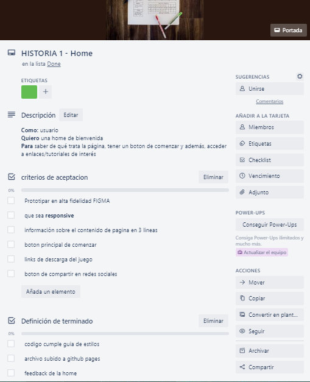
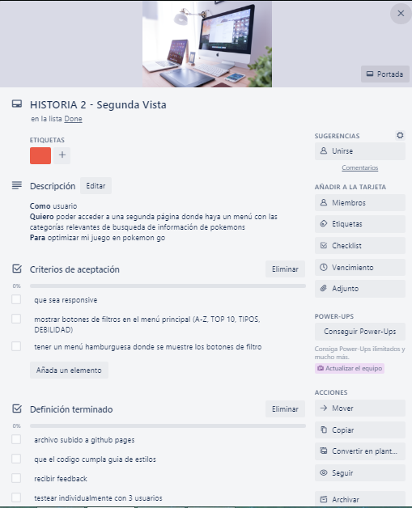
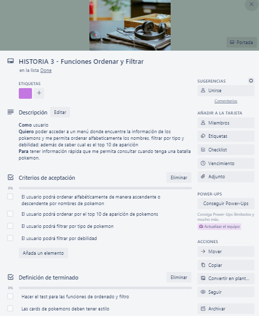
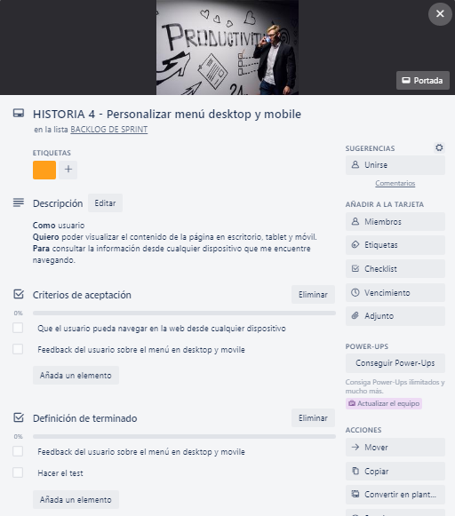
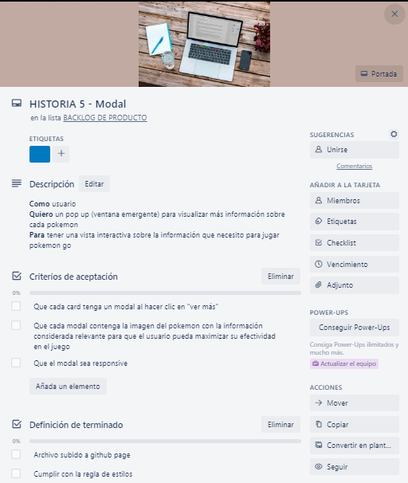
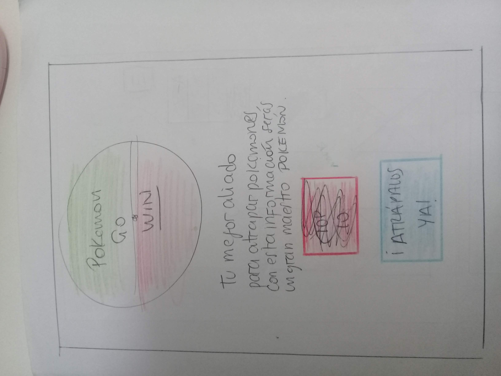
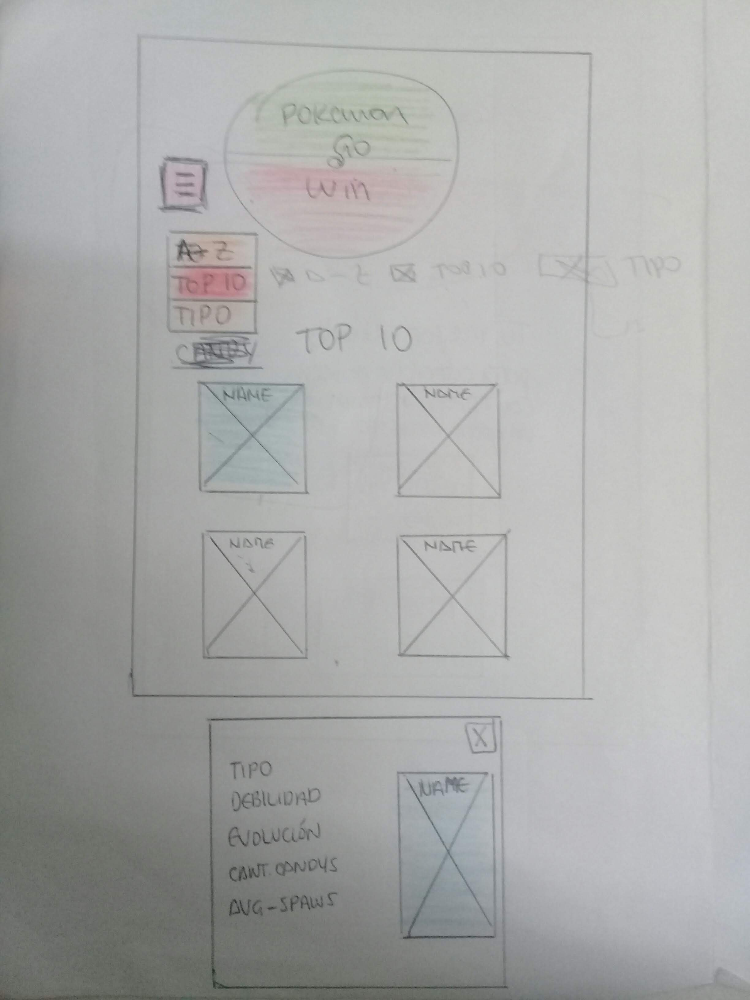
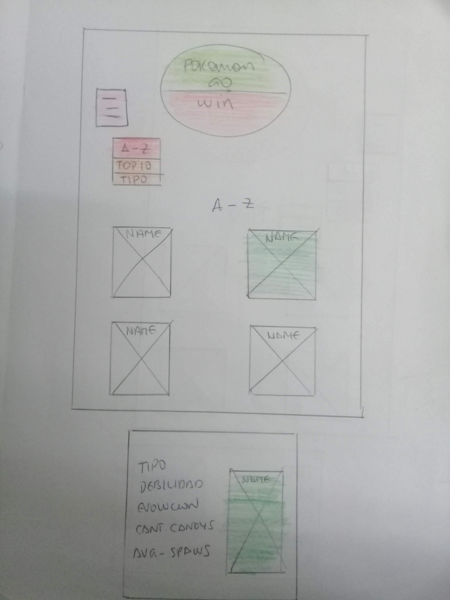
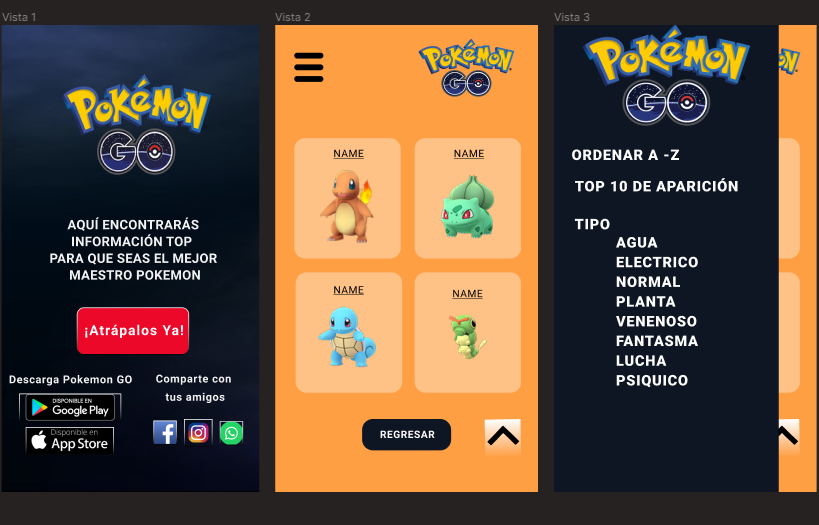

# Data Lovers

***

## Objetivos de aprendizaje

### UX

- [X] Diseñar la aplicación pensando y entendiendo al usuario.
- [x] Crear prototipos para obtener _feedback_ e iterar.
- [x] Aplicar los principios de diseño visual (contraste, alineación, jerarquía).
- [x] Planear y ejecutar _tests_ de usabilidad.

### HTML y CSS

- [x] Entender y reconocer por qué es importante el HTML semántico.
- [x] Identificar y entender tipos de selectores en CSS.
- [x] Entender como funciona `flexbox` en CSS.
- [x] Construir tu aplicación respetando el diseño planeado (maquetación).

### DOM

- [x] Entender y reconocer los selectores del DOM (querySelector | querySelectorAll).
- [X] Manejar eventos del DOM. (addEventListener)
- [ ] Manipular dinámicamente el DOM. (createElement, appendchild, innerHTML, value)

### Javascript

- [ ] Manipular arrays (`filter` | `map` | `sort` | `reduce`).
- [ ] Manipular objects (key | value).
- [x] Entender el uso de condicionales (`if-else` | `switch`).
- [x] Entender el uso de bucles (`for` | `forEach`).
- [x] Entender la diferencia entre expression y statements.
- [x] Utilizar funciones (parámetros | argumentos | valor de retorno).
- [x] Entender la diferencia entre tipos de datos atómicos y estructurados.
- [x] Utilizar ES Modules (`import` | `export`).

### Pruebas Unitarias (_testing_)
- [x] Testear funciones (funciones puras).

### Git y GitHub
- [X] Ejecutar comandos de git (`add` | `commit` | `pull` | `status` | `push`).
- [x] Utilizar los repositorios de GitHub (`clone` | `fork` | gh-pages).
- [ ] Colaborar en Github (pull requests).

### Buenas prácticas de desarrollo
- [x] Organizar y dividir el código en módulos (Modularización).
- [x] Utilizar identificadores descriptivos (Nomenclatura | Semántica).
- [x] Utilizar linter para seguir buenas prácticas (ESLINT).

### Definición del producto

Escogí trabajar con la data pokemon para darle al tan mundialmente reconocido juego de Pokemon Go; una nueva experiencia al usuario a la hora de interactuar con la información que necesita conocer sobre cada pokemon.

Normalmente el usuario de Pokemon Go necesita acceder a información sobre los pokemones con los que realizará una batalla. En internet hay mucha información; sin embargo, note que había pocos sitios donde simplificaban la información valiosa para el usuario de Pokemon Go, por ende, pensé en mostrar esta información de una manera más amigable al usuario a través de secciones donde podrá ver filtros con la información de su interés.                                                                                                   
### Historias de usuario

### Diseño de la Interfaz de Usuario

Primero prototipé en papel lo que queria mostrar al usuario pensando en mobile first.
Luego en el prototipado de alta fidelidad, también está diseñado para desktop y tablet.

#### Prototipo de baja fidelidad

#### Prototipo de alta fidelidad

El prototipo completo en figma para mobil, desktop y tablet pueden verlo aquí: https://www.figma.com/file/yw6DGUAgBtvsmPaRVGcAAY/Pokemon-Go?node-id=11%3A2

#### Testeos de usabilidad

Después de mostrar el prototipo de baja fidelidad; recibimos el feedback de tres usuarios:

** Usuario 1: Se entiende el proceso de cómo acceder a los filtros en el menú.
** Usuario 2: Deberían usar colores acorde Pokemon Go.
** Usuario 3: El modal debería ser más grande.

En el prototipo de alta fidelidad, recibimos el feedback de tres usuarios:

** Usuario 1: La home debería tener otro tipo de fuente.
** Usuario 2: Pueden mejorar el diseño de las cards.
** Usuario 3: Si logro recorrer la página sin problemas en el diseño de mobile y escritorio.

Luego de dos semanas de avance en la home y en el menú; recibimos feedback de dos personas:

Usuario 1: El menú para mobile podría estar en la parte derecha. Por lo demás, entiendo todo.
Usuario 2: No le encuentro sentido a la home, prefiero tener contacto primero con el menu para filtrar información.

Después de recibir feedback de los dos usuarios, realizamos cambios importantes en nuestro diseño.

El menú hamburguesa lo trasladamos a la parte derecha y respecto a la home; aunque costó tiempo realizarla; la eliminamos para tener un encuento mas directo con el usuario.
***
